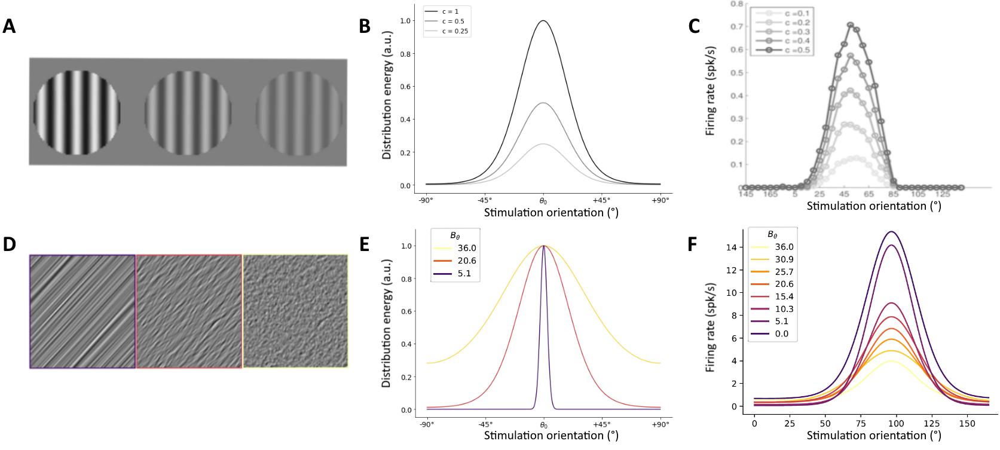

# University of Montreal - NSC6084 course project
## Can a contrast invariance model account for bandwidth invariance in the primary visual cortex ?
## Repository structure
Model development will first start in the ./python and will then be translated in MATLAB under the ./matlab folder

## Project description
The goal of this project is to model the change of neuronal activity of the primary visual cortex (V1) in response to certain modulations of the visual input. It is known that orientation selective activity [1,2] in V1 is invariant to the contrast of visual stimulations [3], an experimental result which has been extensively modeled from single neuron [4,5] to circuits [6,7]. We have original experimental data that shows a similar activity pattern for variations of bandwidth of visual stimulations [8]. Hence, we wish to use the theoretical framework provided by contrast invariance models to investigate the mechanisms underlying bandwidth invariance

### Introduction
V1 neurons are sensitive to the orientation of visual stimulations and are more active at a certain preferred orientation [1,2], a relationship which is described by the tuning curve of a neuron [fig1C, 1F]. How these tuning curves react to variations of visual input is a central question in visual neuroscience. One particularly well-studied variation of the orientation input is the variation of contrast. Previous studies have shown that decreasing the contrast of stimulations – i.e. decreasing the peak height of the input distribution [fig 1B] – does not change the orientation encoded by the neuron [3]. As such, orientation selectivity is said to be invariant to contrast [fig1C]. Recently, we have gathered data that show that decreasing the precision of stimulations – i.e. increasing the bandwidth of the input distribution [fig 1E] – produces similar neuronal activity [fig1D-F]. As these are new results, there is no theoretical framework to explain them. The striking similarity between contrast-invariant activity and bandwidth-invariant orientation selectivity is the basis for our project, in which we want to use a contrast-invariant model to explain our new experimental findings.
Models of orientation selectivity are numerous [9], and date back to the very first articles on the matter. Indeed, Hubel and Wiesel proposed a simple model of orientation selectivity to explain their results in the articles that earned them the Nobel Prize. In this model, oriented receptive fields arise from the convergence of unoriented thalamic inputs [2]. A neuronal spike threshold is then used to explain why there is no firing at orientations orthogonal to the neurons’ preferred orientation. However, this classical model fails to explain why neurons are still orientation selective at low contrast. Indeed, a low threshold would explain why there is still activity at low contrast but would remove the orientation selectivity at high contrast, as the neuron would fire for any stimulation. Conversely, a high threshold would cause no response to low contrast stimulations. Hence, the classical model predicts that tuning curve should broaden as contrast increases, much like an iceberg is broader at it rises out of the sea: this is the “iceberg effect” [10], which is in disagreement with experimental results of contrast invariance [3].
A contrast-invariant model that proposes a solution to this observation has been proposed by Finn and al. in a 2007 article [4]. In this article, the authors show that contrast-gain control, additive noise and firing rate are sufficient to explain contrast-invariant tuning. They show that a non-linear relationship between membrane depolarization and contrast allows selective firing at all contrasts. Noise fluctuations in the membrane potential then smooth out the resulting tuning curve, and a fixed threshold as proposed in the classical model can then be applied to explain the experimental results of contrast invariance.

### Goal
The rationale behind this project is to use the model of Finn et al. to provide a theoretical framework to our bandwidth-invariant experimental observations. The use of this model seems very promising because it relies on three “canonical” neuronal operations [11, 12], meaning it will likely extend to our results. In more general terms, this project will answer the question of knowing whether V1 uses the same mechanisms for contrast and bandwidth resilience.

### Approach
As previously stated, we plan to extend the Finn et al. model to account for our results. We will first start by implementing single-neuron simulations from scratch, working to then add tuning curves input and nonlinearities of their model. This should constitute the main effort of the project, which will be validated by reproducing the results from the original model. The extension to our data will then consist of replacing amplitude variations with bandwidth variations [fig1B, 1E]. Additionally, we plan on predicting new experimental results, by seeing how the tuning curves behave in the 2D bandwidth+contrast variation space.
Success in this project would consist in showing that we can achieve an invariant response in both contrast and bandwidth with the same model. It is nonetheless possible that these are two different constraints under which V1 operates, which are not solved using the same neuronal mechanisms. Depending on how straightforward the implementation of the first model has been, we could also try to extend our project to circuit-level contrast invariant model, which use intracortical inhibition to produce contrast invariance in cells that are weakly driven by thalamic inputs [6,7].

### References
[1] Hubel, D. H., & Wiesel, T. N. (1959). Receptive fields of single neurones in the cat's striate cortex. The Journal of physiology, 148(3), 574.

[2] Hubel, D. H., & Wiesel, T. N. (1962). Receptive fields, binocular interaction and functional architecture in the cat's visual cortex. The Journal of physiology, 160(1), 106.

[3] Skottun, B. C., Bradley, A., Sclar, G., Ohzawa, I., & Freeman, R. D. (1987). The effects of contrast on visual orientation and spatial frequency discrimination: a comparison of single cells and behavior. Journal of neurophysiology, 57(3), 773-786.

[4] Finn, I. M., Priebe, N. J., & Ferster, D. (2007). The emergence of contrast-invariant orientation tuning in simple cells of cat visual cortex. Neuron, 54(1), 137-152.

[5] Hansel, D., & Van Vreeswijk, C. (2002). How noise contributes to contrast invariance of orientation tuning in cat visual cortex. Journal of Neuroscience, 22(12), 5118-5128.

[6] Kremkow, J., Perrinet, L. U., Monier, C., Alonso, J. M., Aertsen, A., Frégnac, Y., & Masson, G. S. (2016). Push-pull receptive field organization and synaptic depression: mechanisms for reliably encoding naturalistic stimuli in V1. Frontiers in neural circuits, 10, 37.

[7] Troyer, T. W., Krukowski, A. E., Priebe, N. J., & Miller, K. D. (1998). Contrast-invariant orientation tuning in cat visual cortex: thalamocortical input tuning and correlation-based intracortical connectivity. Journal of Neuroscience, 18(15), 5908-5927.

[8] Leon, P. S., Vanzetta, I., Masson, G. S., & Perrinet, L. U. (2012). Motion clouds: model-based stimulus synthesis of natural-like random textures for the study of motion perception. Journal of neurophysiology, 107(11), 3217-3226.

[9] Olshausen, B. A., & Field, D. J. (2005). How close are we to understanding V1?. Neural computation, 17(8), 1665-1699.

[10] Carandini, M. (2007). Melting the iceberg: contrast invariance in visual cortex. Neuron, 54(1), 11-13.

[11] Kouh, M., & Poggio, T. (2008). A canonical neural circuit for cortical nonlinear operations. Neural computation, 20(6), 1427-1451.

[12] Carandini, M., & Heeger, D. J. (2012). Normalization as a canonical neural computation. Nature Reviews Neuroscience, 13(1), 51-62.

[13] Zhu, M., & Rozell, C. J. (2013). Visual nonclassical receptive field effects emerge from sparse coding in a dynamical system. PLoS Comput Biol, 9(8), e1003191.
